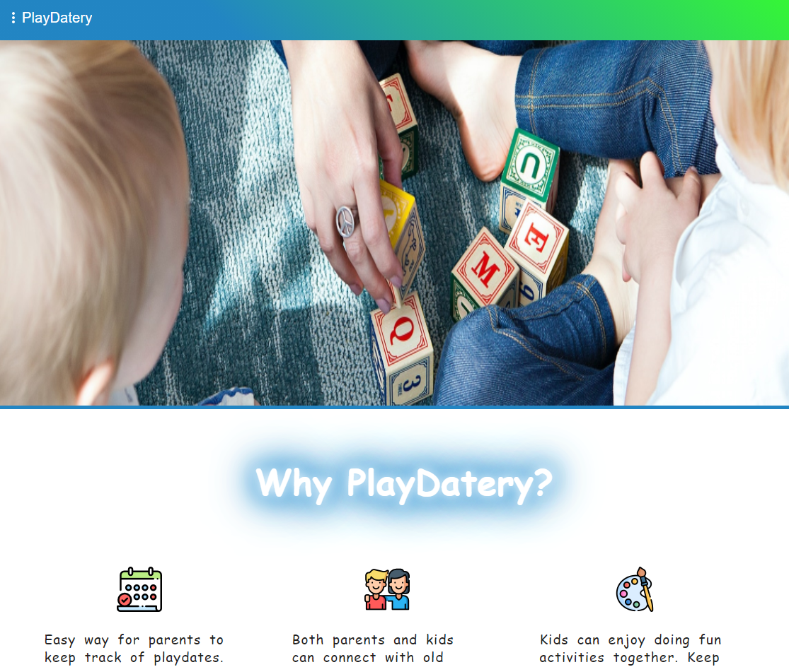
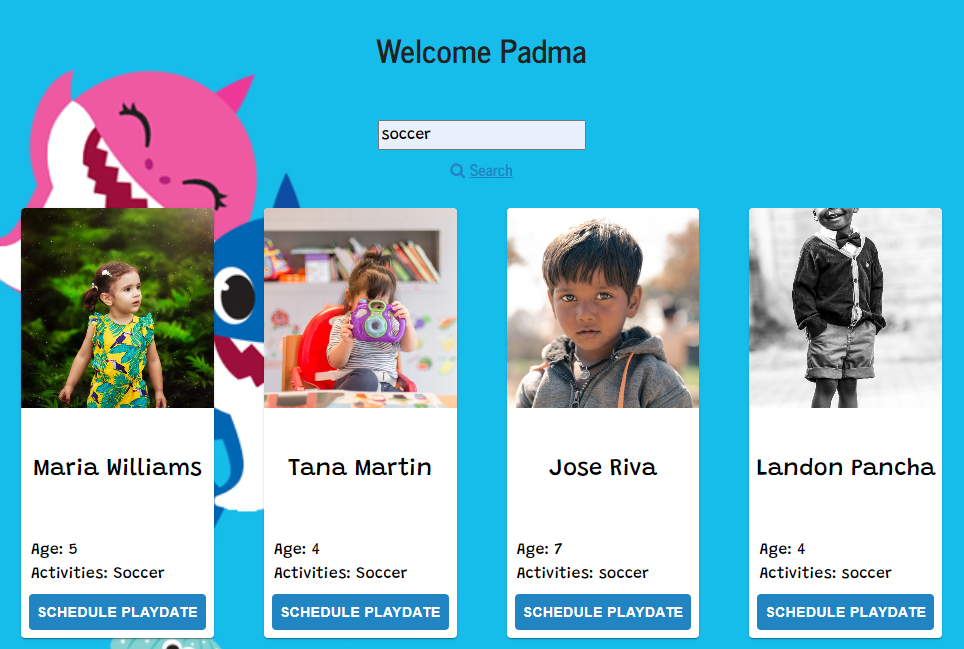
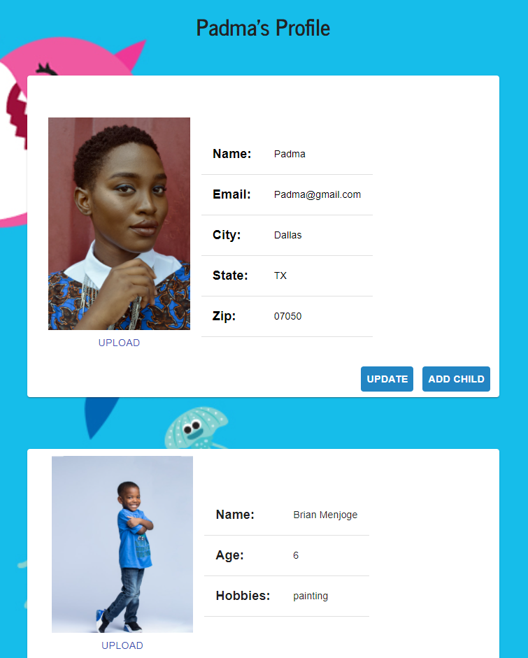

# PlayDatery

## Deployed site
[https://pacific-anchorage-98148.herokuapp.com](https://pacific-anchorage-98148.herokuapp.com)

## Public Homepage

## Description:
PlayDatery will provide parents the ability to find and connect their kids with other kids with similar interests. Parents can either host a playdate or send their kids to another parent’s home.

## Search
Once logged in you can search by name or activity to find kids

## Profile
Edit and Update your profile with your address, photo, and kid's interests.

## Technologies:
HTML, CSS, React, Material UI, NodeJS, Express, MongoDB, AWS, and Firebase.

## License:
Created by Laureni Wilkinson-Sanchez & Sandesh Menjoge
